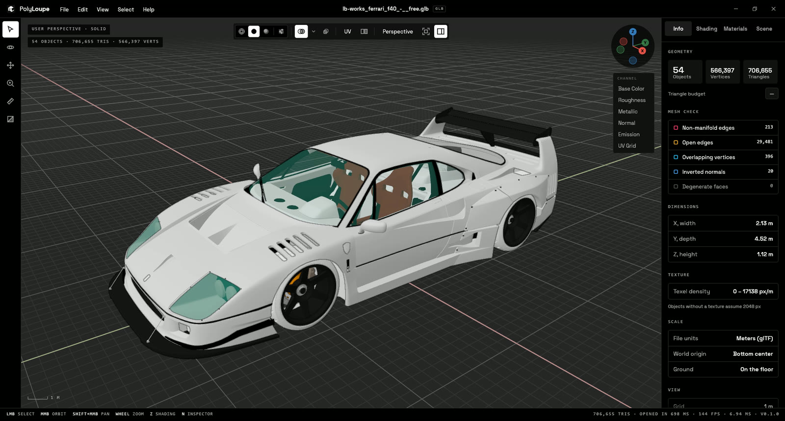
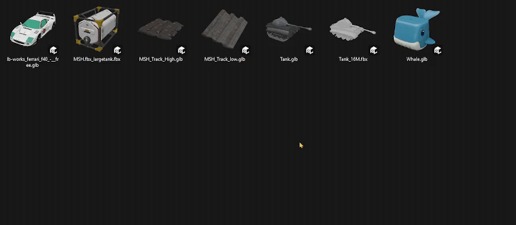
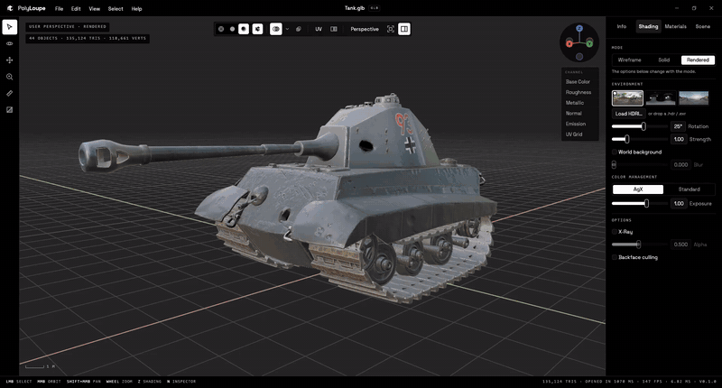
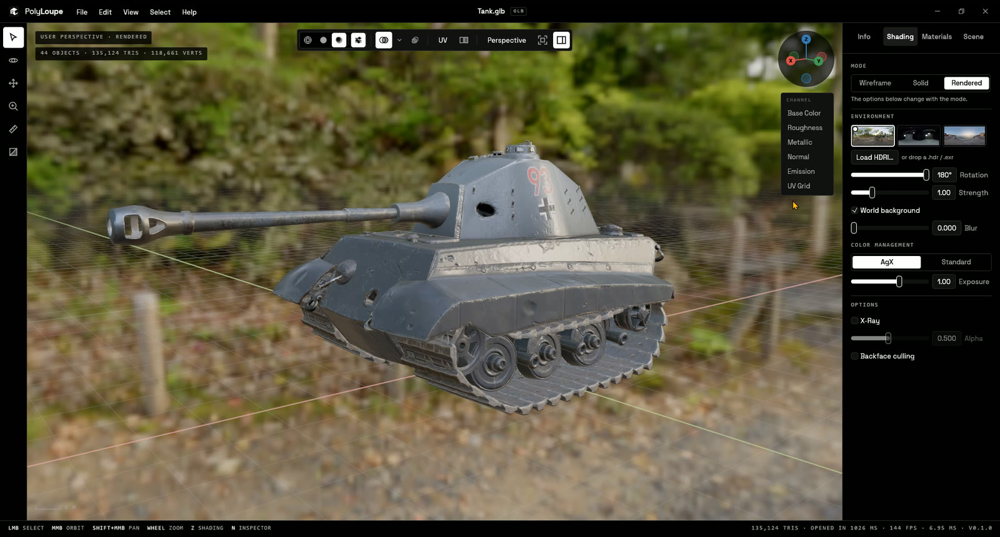
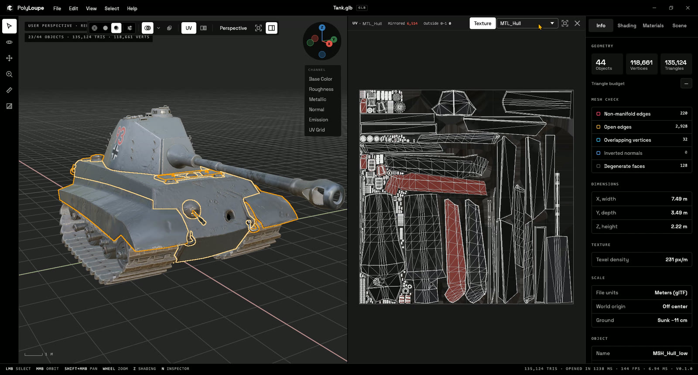
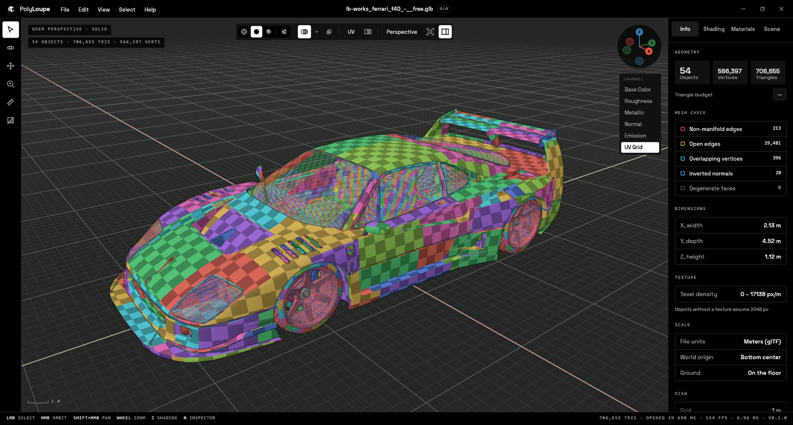
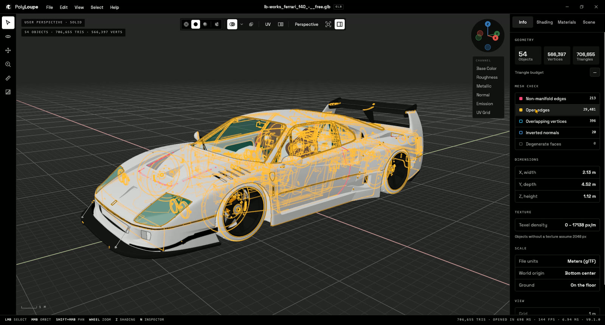
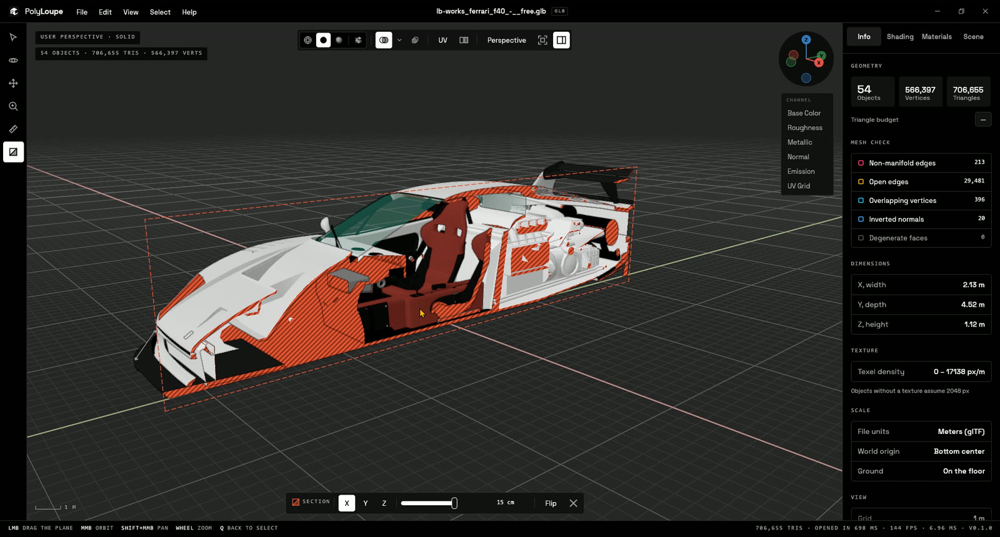
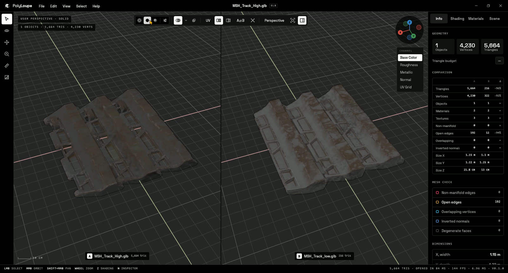

<picture>
  <source media="(prefers-color-scheme: dark)" srcset="assets/brand/polyloupe-lockup-white.svg">
  
</picture>

# PolyLoupe

The 3D viewer for people who make assets. Opens in a blink, moves like Blender (or Maya,
ZBrush, Unity...), shows what's really in the model. Native, free and open source.

**Every polygon, up close.**



## Download

Windows 10/11 (x64): get `PolyLoupe-Setup-<version>.exe` from the
[latest release](../../releases/latest). The installer isn't code-signed yet, so SmartScreen may
say "Windows protected your PC": choose **More info > Run anyway**. The installer is built from
this repository by `scripts/build-installer.ps1`, and its SHA-256 is listed in the release notes.



## What it does

- Opens glTF/GLB, FBX, OBJ (with MTL textures), STL, PLY, 3MF, COLLADA (.dae) and STEP
  (.step/.stp); files load on a background thread.
  glTF support covers metallic-roughness PBR, skinning, morph targets, animation,
  `KHR_texture_transform` and `EXT_texture_webp`; other extensions are ignored, and a file that
  requires one (Draco, meshopt, ...) still opens with a warning, though it may look wrong or be
  incomplete. All 150 Khronos glTF Sample Assets open.
  STEP files go through [OpenCASCADE](https://dev.opencascade.org/) with assembly parts, names and
  colors; the CAD kernel lives in its own DLL, loaded only when a STEP file is opened, and the
  meshed result is cached so the same file opens in a moment the next time.
- Two workspaces, picked from the file type (switch in the viewport toolbar):
  - Manufacturing (STL, 3MF, STEP, PLY): millimeters, a Move tool (W) with a transform gizmo,
    Lay on face, Auto orient and Drop to bed for print orientation, Export Model to STL or 3MF,
    and print finishes for quick renders (PLA, PETG, Silk PLA, resin, nylon SLS, metal SLM) with
    layer lines that follow the bed. Parts show as plain satin plastic (a light grey you can change)
    and ignore the file's materials and textures, unless you pick "File materials" in Shading.
  - 3D Art (glTF, FBX, OBJ, DAE): textures, UVs, channels and animation, in meters like Blender.
- Explorer thumbnails for all of them (rendered by a small self-contained handler, like Blender's
  for .blend files), plus "Open with" and Default apps entries.
- Wireframe, Solid and Rendered shading, like Blender:
  - Solid: Studio, MatCap or Flat lighting; Material, Single, Random, Texture or Attribute color.
  - Texture channels: Base Color, Roughness, Metallic, Normal, AO, Emission, Alpha, UV grid,
    for the whole scene or per object (C / Shift+C cycle them).
  - Rendered: PBR with image-based lighting, AgX. Blender's own HDRIs built in (Forest, the
    Material Preview default, Studio, Sunset), plus your `.hdr` / `.exr` library.
- Asset checks for artists:
  - Mesh check: non-manifold edges, open edges, overlapping vertices, degenerate faces.
  - Measure (M) with vertex snapping, per-axis deltas.
  - Cross-section along X, Y or Z with a hatched cap.
  - A/B compare of two models (side by side or split, synced camera and animation).
  - UV layout pane (U) with the texture behind, mirrored and out-of-0–1 islands counted; show the selected objects or a whole texture set (every object using one material).
  - Normals and face orientation overlays, origins, scale and declared units, pivot.
  - Texel density and a triangle budget bar.
- Animation: skinning, morph targets and node animation (glTF, FBX) with a Blender-style timeline.
- Exports: image (F12, 1×/2×/4×, optionally transparent) and turntable (GIF, or MP4 with ffmpeg).
- Navigation presets: Blender, Maya · Cinema 4D · Substance, ZBrush, 3ds Max, Unity · Unreal
  (RMB + WASD fly), CAD (SolidWorks); Z-up or Y-up axis labels.
- English and Italian UI (follows Windows by default).
- Renders only when something changes: no GPU usage while idle.

## Screenshots

| | |
|---|---|
|  |  |
| Texture channels, one key away (C) | Rendered: PBR with Blender's HDRIs |
|  |  |
| UV layout of a whole texture set | UV grid checker |
|  |  |
| Mesh check | Cross-section |
|  | |
| A/B compare, high vs low poly | |

## Feedback

PolyLoupe is young and shaped by the people who use it. Found a model that opens wrong, or miss
a check you do every day? [Open an issue](../../issues/new/choose) (Help > Report a bug or
suggest a feature in the app), or start a [discussion](../../discussions). No telemetry: the app
never sends anything anywhere.

## Controls

Blender's by default (the mouse part changes with the navigation preset):

| Input | Action |
|---|---|
| MMB drag / Alt+LMB drag | Orbit |
| Shift+MMB drag | Pan |
| Wheel / Ctrl+MMB drag | Zoom |
| LMB / Shift+LMB | Select / extend selection |
| A / Alt+A | Select all / none |
| H / Shift+H / Alt+H | Hide selected / hide others / reveal |
| N | Side panel (also the button at the top right) |
| Home / `.` | Frame all / frame selected |
| 1 / 3 / 7 (Ctrl for opposite) | Front / Right / Top view |
| 2 4 6 8 | Orbit in 15° steps |
| 5 | Perspective / orthographic |
| Z | Shading pie menu |
| Shift+Z / Alt+Z / Shift+Alt+Z | Toggle wireframe / X-ray / overlays |
| Q / O / G / M | Select / Orbit / Pan / Measure tool |
| W | Move tool (Manufacturing): drag arrows, rings or center, Ctrl snaps |
| L / Shift+L / B / Alt+G | Lay on face / auto orient / drop to bed / reset (Move tool) |
| Del / Shift+Del | Remove the last measurement / all of them |
| Ctrl+Z | Undo the last move (or measurement, in the Measure tool) |
| C / Shift+C | Next / previous texture channel |
| U | UV layout |
| Space | Play / pause animation |
| ← / → (Shift for start/end) | Step frames |
| Ctrl+O / Ctrl+Shift+O | Open file / compare with a second file |
| F12 | Export image |
| Ctrl+, | Preferences |
| F11 | Fullscreen |

Top-row digits work as numpad keys, so laptops without a numpad are covered.

## Build

Requires Rust (stable) and, on Windows, the MSVC build tools. The STEP reader also needs CMake:
the first build compiles OpenCASCADE from its official sources into `target/occt` (10-30 minutes,
once).

```bash
cargo build --release --workspace
cargo run --release -- path/to/model.glb
```

## Installer and Explorer thumbnails

```bash
powershell -ExecutionPolicy Bypass -File scripts/build-installer.ps1
```

Builds everything and writes `target\installer\PolyLoupe-Setup-<version>.exe` (English or Italian
wizard, built with [Inno Setup](https://jrsoftware.org/isinfo.php)). It installs to
`Program Files`, registers the thumbnail handler, adds PolyLoupe to "Open with" and Default apps
for .glb .gltf .fbx .obj .stl .ply .3mf .dae .step .stp, and offers to open Default apps at the end (Windows
doesn't let installers pick the default app themselves).

The thumbnail handler works like Blender's handler for .blend files: Windows runs it in its
isolated thumbnail process and hands it the file's bytes, and the DLL parses the model and renders
it on the CPU (no GPU, no helper process), in about 30 ms for a typical model. .gltf and .obj files
can keep their data in files next to them (buffers, .mtl, textures), which that isolated process
can't see, and STEP needs the OpenCASCADE DLL next to polyloupe.exe, so those formats get a second
handler, built like F3D's: Windows gives it the
file's path, and it runs `polyloupe --thumbnail` in a separate process with a timeout, so a broken
file never takes Explorer down. `polyloupe --thumbnail model.glb out.png 256` renders exactly what
Explorer shows.

Without the installer:

```bash
powershell -ExecutionPolicy Bypass -File scripts/install-thumbnails.ps1 -AllUsers
```

Drop `-AllUsers` to install for the current user only (`%LOCALAPPDATA%\Programs\PolyLoupe`, no
admin), though Windows may take a while to notice a per-user handler; add `-Uninstall` to remove
either.

Explorer keeps the thumbnails it already made: clear "Thumbnails" in Disk Cleanup to see files you
browsed before an update with the new renderer.

## Screenshots from the command line

```bash
cargo run --release -- model.glb --capture out.png --size 1280x800 --shading rendered --view front
```

Flags: `--shading wireframe|solid|rendered`, `--lighting studio|matcap|flat`,
`--color material|single|random|texture|attribute`, `--pass basecolor|roughness|metallic|normal|ao|emission|alpha|uvgrid`,
`--matcap N`, `--env forest|studio|sunset|PATH.hdr|PATH.exr`, `--env-bg`, `--xray`, `--wire-overlay`,
`--workspace manufacturing|art`, `--file-materials`, `--no-grid`, `--no-outline`, `--view front|back|right|left|top|bottom`, `--ortho`,
`--popover shading|overlays|channel|preferences|welcome`, `--nav blender|maya|zbrush|max|gameengine|cad`, `--pie`, `--sidebar`, `--select N`, `--click X,Y`,
`--channel PASS` (on the selection), `--clip N`, `--frame N`, `--fps`, `--popover preferences`.
`--export OUT.png [--export-scale 1|2|4] [--transparent]` runs File > Export Image instead of a
window screenshot.

Capture runs never change your saved preferences.

## License

PolyLoupe is free software: you can redistribute it and/or modify it under the terms of the
[GNU General Public License](LICENSE), version 3 or (at your option) any later version.
Third-party components keep their own licenses (`THIRD-PARTY-NOTICES.txt`, generated by
`scripts/third-party-notices.py`, ships with the installer). The name and logo are covered by
[TRADEMARKS.md](TRADEMARKS.md).
