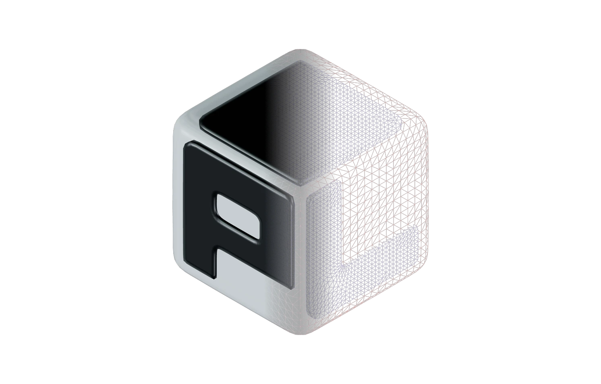

# PolyLoupe 0.2.0

PolyLoupe now views 3D parts as well as 3D art, and makes final renders. This release adds STEP
files, Manufacturing and 3D Art workspaces, Move/Rotate/Scale tools, a Render tab with lights and
soft shadows, better glass and car paint, and a Performance mode for low-end PCs.

## What's new

### Parts and manufacturing

- **STEP / STP files** open through OpenCASCADE. The CAD kernel lives in its own DLL
  (`polyloupe_step.dll`), loaded only when a STEP file is opened, so startup and every other
  format are unaffected. Assembly parts, names and colors are kept. The meshed result is cached
  in `%LOCALAPPDATA%\PolyLoupe\cache\step`, so the second open is instant. STEP files also get
  Explorer thumbnails.
- **Manufacturing and 3D Art workspaces.** Manufacturing (STL, 3MF, STEP, PLY) shows millimeters
  and print tools. 3D Art (glTF, FBX, OBJ, DAE) keeps meters, textures, UVs and animation. The
  workspace follows the file type; the switch is at the left of the viewport toolbar.
- **Move (W), Rotate (E) and Scale (R)**, like Blender, with a gizmo that stays steady while you
  drag and Ctrl snapping (15° steps, 0.1 scale, grid moves). Lay on face, Auto orient and Drop to
  bed for print orientation. Export Model saves the result to STL or 3MF.
- **Part materials.** One color (picker and hex field) or the file's own materials. With one
  color you can pick a material: FDM plastic (PLA, PLA Silk, PETG, ABS) and resin with layer
  lines, nylon SLS, or metal (polished, satin, brushed, blasted).
- **Surface wear**: Grain and Scratches, from CC0 ambientCG maps, over any material.

### Rendering

- **Render tab**: resolution presets (viewport, 1080p, 1440p, 4K, square, portrait or custom),
  2× and 4× supersampling, transparent background, a framing guide, and the turntable export.
  F12 renders and saves the image.
- **Lights**: a key light that follows the HDRI or goes where you put it, plus up to 5 more, each
  with color (temperature presets), intensity and direction. Drag their handles in the viewport:
  Overlays > Lights shows them, and adding a light turns them on.
- **Soft shadows** on the model and on a shadow floor, with a softness slider, and a studio
  backdrop.
- **Glass and car paint**: transmission, clearcoat and better reflections.
- **Compare shading styles** on the same model: a split view with A and B in different modes
  (for example Rendered on one side, Wireframe on the other) and a soft gradient across the
  divider. Exported images and turntables keep the comparison exactly as the viewport shows it.
- **Two MatCaps from Blender**: Clay Warm and Basic Bright, with Blender's diffuse and specular
  layers.

### Everyday use

- **Performance mode** (Preferences > Viewport > Graphics) for integrated GPUs and older PCs:
  no anti-aliasing, the view at 100% scale on high-DPI screens, lighter shadows. Exported images
  keep full quality.
- **Lighter on the GPU**: the 3D view is redrawn only when the image would change, not when you
  hover the interface, and shadows are redrawn only when lights or the model change.
- **Starts about 180 ms faster.**
- **Update check**: once a day PolyLoupe asks GitHub whether a newer release exists and shows a
  banner with a Download button. Preferences > Check for updates turns it off. Nothing is
  downloaded or installed by the app.
- The overlays switch (Shift Alt Z) also hides the split view guides.
- Measure: Delete removes only the last measurement. Models whose buffers exceed 256 MB open.

## Notes

- STEP loading is dominated by OpenCASCADE building the exact geometry; the meshing runs on all
  cores and the result is cached. Big assemblies can still take several seconds the first time.
- The 0.1.x "filament color" and "model colors" options are replaced by part materials; a color
  chosen in 0.1.x is not carried over.
- The installer is about twice the size of 0.1.x because of OpenCASCADE.
- PolyLoupe is GPL-3.0-or-later; OpenCASCADE is LGPL 2.1 with its exception, and its notice is
  installed with the app. The two Blender MatCaps and the ambientCG maps are CC0.

## In breve (IT)

- **File STEP/STP** tramite OpenCASCADE, in una DLL caricata solo quando serve; risultato in
  cache, la seconda apertura è immediata. Miniature in Esplora file anche per STEP.
- **Due aree di lavoro**: Manifattura (STL, 3MF, STEP, PLY: millimetri e strumenti di stampa) e
  3D Art (glTF, FBX, OBJ, DAE: texture, UV, animazione).
- **Sposta (W), Ruota (E), Scala (R)** come in Blender, gizmo stabile, snap con Ctrl, Appoggia su
  faccia, Orienta automaticamente, Export STL/3MF.
- **Materiali del pezzo**: plastiche FDM, resina, nylon, metalli, con usura (grana, graffi).
- **Tab Render**: risoluzioni, supersampling 2×/4×, sfondo trasparente, turntable; luci
  aggiuntive (fino a 6) da trascinare nella vista, ombre morbide, vetro e vernice auto migliori.
- **Confronto tra stili di shading** sullo stesso modello, con gradiente; i render includono il
  confronto. Due MatCap da Blender: Clay Warm e Basic Bright.
- **Modalità Prestazioni** (Preferenze > Vista 3D > Grafica) per PC poco potenti; meno lavoro per
  la GPU anche in modalità normale.
